# AI Agent Methodologies for Clean Room Implementation

This page covers the core methodologies for using AI agents in clean room implementation. These methodologies define how autonomous AI agents observe, specify, implement, and verify clean room projects without violating isolation requirements.

## Agent Architecture Overview

```mermaid
flowchart TB
    subgraph Layer1["🎯 Orchestration Layer"]
        P[Project Coordinator Agent]
    end
    
    P --> O
    P --> I
    P --> V
    
    subgraph Observation["📋 Observation Team"]
        O1[API Probe Agent]
        O2[State Machine Agent]
        O3[Edge Case Agent]
        O4[Spec Writer Agent]
    end
    
    subgraph Implementation["💻 Implementation Team"]
        I1[TDD Agent]
        I2[Test Writer Agent]
        I3[Refactor Agent]
        I4[Spec-Driven Agent]
    end
    
    subgraph Verification["✅ Verification Team"]
        V1[Parity Test Agent]
        V2[Regression Agent]
        V3[Performance Agent]
        V4[Security Agent]
    end
    
    O1 --> O
    O2 --> O
    O3 --> O
    O4 --> O
    
    I1 --> I
    I2 --> I
    I3 --> I
    I4 --> I
    
    V1 --> V
    V2 --> V
    V3 --> V
    V4 --> V
    
    style Layer1 fill:#8e44ad,stroke:#6c3483,stroke-width:3px,color:#fff
    style Observation fill:#3498db,stroke:#2980b9,stroke-width:3px,color:#fff
    style Implementation fill:#e67e22,stroke:#d35400,stroke-width:3px,color:#fff
    style Verification fill:#27ae60,stroke:#2ecc71,stroke-width:3px,color:#fff
```



## Core Principles

### Principle 1: Agent Role Separation

Agents must have strictly separated roles to maintain clean room integrity:

```
ROLE_SEPARATION:
  
  Observation Agents:
    Purpose: Observe and document original system behavior
    Access: Original system APIs, endpoints, UI
    Constraint: Cannot access implementation code
    Output: Behavioral specifications as tests
    
  Implementation Agents:
    Purpose: Write code to pass specification tests
    Access: Specification documents, test files
    Constraint: Cannot see original system or observations
    Output: Production code
    
  Verification Agents:
    Purpose: Validate new code matches original behavior
    Access: Both original and new systems
    Constraint: Cannot modify either system
    Output: Verification reports, divergence alerts
    
  Orchestration Agents:
    Purpose: Coordinate agent workflows
    Access: All agent outputs
    Constraint: Cannot access original system directly
    Output: Task coordination, conflict resolution
```

### Principle 2: Information Flow Control

```
INFORMATION_FLOW:
  
  Allowed Flows:
    Observation → Specification
    Specification → Implementation
    Implementation → Verification
    Verification → Orchestration
    
  Forbidden Flows:
    Original System → Implementation (direct)
    Observation → Implementation (direct)
    Implementation → Observation (feedback)
```

### Principle 3: Test-First Agent Workflows

All AI agent implementations follow test-first patterns:

```
AGENT_WORKFLOW:
  1. Specification Agent creates test
  2. Test runs against original (passes)
  3. Test runs against new (fails)
  4. Implementation Agent writes code
  5. Test runs against new (passes)
  6. Verification Agent confirms parity
```

## Methodology 1: Hierarchical Agent Delegation

### Overview

A top-level coordinator agent delegates tasks to specialized subagents based on their capabilities.

### Architecture

```
COORDINATOR_AGENT
    │
    ├──→ Specification Agent (API probing)
    │       │
    │       └──→ Documentation Agent
    │
    ├──→ Implementation Agent (Code writing)
    │       │
    │       ├──→ Refactoring Agent
    │       └──→ Testing Agent
    │
    ├──→ Verification Agent (Parity checks)
    │       │
    │       ├──→ Performance Agent
    │       └──→ Security Agent
    │
    └──→ Orchestration Agent (Coordination)
            │
            ├──→ Progress Tracking Agent
            └──→ Escalation Agent
```

### Implementation

```python
# Top-level coordinator
class CleanRoomOrchestrator:
    def __init__(self):
        self.specification_agent = SpecificationAgent()
        self.implementation_agent = ImplementationAgent()
        self.verification_agent = VerificationAgent()
    
    def implement_feature(self, feature_spec):
        """
        Implement a feature through agent delegation
        """
        # Step 1: Get specification
        tests = self.specification_agent.probe_apis(feature_spec)
        
        # Step 2: Implement
        implementation = self.implementation_agent.write_code(tests)
        
        # Step 3: Verify
        verification = self.verification_agent.check_parity(
            implementation, tests
        )
        
        return verification
```

### delegate_task Integration

```python
def delegate_feature_implementation(feature_name):
    """
    Example using delegate_task for clean room implementation
    """
    # Specification phase
    spec_result = delegate_task(
        goal=f"Create behavioral tests for {feature_name} feature",
        context="""
        Observe the original system at api.example.com/v1
        Document all endpoints, parameters, and responses
        Write pytest tests that pass against original
        
        Original system access:
        - Base URL: https://api.example.com/v1
        - Auth: Bearer token in header
        
        Output: List of test files with pytest functions
        """,
        toolsets=['browser', 'terminal'],
        max_iterations=20
    )
    
    # Implementation phase (spec is sanitized - no original access)
    impl_result = delegate_task(
        goal=f"Implement {feature_name} using TDD",
        context=f"""
        Tests to implement:
        {spec_result.summary}
        
        Follow TDD:
        1. Red: Verify tests fail on empty implementation
        2. Green: Write minimal code to pass
        3. Refactor: Improve code quality
        
        Constraint: NO access to original system
        Output: Implementation with all tests passing
        """,
        toolsets=['terminal', 'file'],
        max_iterations=30
    )
    
    return impl_result
```

## Methodology 2: Parallel Specification Discovery

### Overview

Multiple specification agents work in parallel on different aspects of the system, with results merged by a coordinator.

### Architecture

```
SPEC_DISCOVERY_SWARM:
  
  Coordinator Agent
    │
    ├──→ User API Agent
    │       ├──→ User creation tests
    │       ├──→ User read tests
    │       └──→ User update tests
    │
    ├──→ Auth API Agent
    │       ├──→ Login tests
    │       ├──→ Token tests
    │       └──→ Permission tests
    │
    ├──→ Data API Agent
    │       ├──→ CRUD tests
    │       ├──→ Query tests
    │       └──→ Aggregation tests
    │
    └──→ Merge Agent
            └──→ Consolidated specification
```

### Implementation

```python
class ParallelSpecDiscovery:
    def __init__(self):
        self.coordinator = SpecificationCoordinator()
        self.spec_agents = [
            SpecAgent("user_api"),
            SpecAgent("auth_api"),
            SpecAgent("data_api"),
            SpecAgent("reporting_api"),
        ]
    
    def discover_specifications(self):
        """
        Run multiple spec agents in parallel
        """
        # Launch all agents
        futures = [
            agent.discover() for agent in self.spec_agents
        ]
        
        # Wait for completion
        results = [f.result() for f in futures]
        
        # Merge results
        merged = self.coordinator.merge(results)
        
        return merged
```

### Merge Strategy

```python
def merge_specifications(agent_results):
    """
    Merge multiple agent specifications with conflict resolution
    """
    merged = {}
    
    for result in agent_results:
        for endpoint, spec in result.specifications.items():
            if endpoint not in merged:
                merged[endpoint] = spec
            else:
                # Conflict resolution: majority vote or escalation
                merged[endpoint] = resolve_conflict(
                    merged[endpoint], spec
                )
    
    return merged
```

## Methodology 3: Swarm-Based Edge Case Discovery

### Overview

Many simple agents explore different behaviors simultaneously to discover edge cases through breadth rather than depth.

### Architecture

```
EDGE_CASE_SWARM:
  
  100+ Simple Agents
    │
    ├──→ Boundary Agents (value boundaries)
    ├──→ Type Agents (type variations)
    ├──→ State Agents (state transitions)
    ├──→ Timing Agents (timing variations)
    ├──→ Error Agents (error injection)
    └──→ Load Agents (concurrency)
```

### Agent Types

```python
EDGE_CASE_AGENT_TYPES:
  
  BoundaryAgents:
    - Test min/max values
    - Test empty/null values
    - Test overflow conditions
    
  TypeAgents:
    - Test different data types
    - Test encoding variations
    - Test character sets
    
  StateAgents:
    - Test state machine transitions
    - Test concurrent state changes
    - Test recovery from invalid states
    
  TimingAgents:
    - Test race conditions
    - Test timeout scenarios
    - Test rate limiting
    
  ErrorAgents:
    - Test error recovery
    - Test partial failures
    - Test cascading failures
```

### Implementation

```python
class EdgeCaseSwarm:
    def __init__(self, num_agents=50):
        self.agents = self._create_agents(num_agents)
    
    def _create_agents(self, num_agents):
        """
        Create diverse agent types for coverage
        """
        agents = []
        
        # Boundary agents
        for i in range(num_agents // 4):
            agents.append(BoundaryAgent())
        
        # Type agents
        for i in range(num_agents // 4):
            agents.append(TypeAgent())
        
        # State agents
        for i in range(num_agents // 4):
            agents.append(StateAgent())
        
        # Timing agents
        for i in range(num_agents // 4):
            agents.append(TimingAgent())
        
        return agents
    
    def run_discovery(self):
        """
        Run swarm discovery
        """
        findings = []
        
        for agent in self.agents:
            try:
                result = agent.discover_edge_cases()
                findings.extend(result)
            except Exception as e:
                # Agent failed, continue with others
                pass
        
        # Deduplicate and prioritize
        return self.prioritize_findings(findings)
```

## Methodology 4: Continuous Verification Loop

### Overview

Continuous verification runs tests against both original and new systems in parallel, with automatic divergence detection.

### Architecture

```
VERIFICATION_LOOP:
  
  Test Runner
      │
      ├──→ Run test against original
      │       └──→ Capture result A
      │
      ├──→ Run test against new
      │       └──→ Capture result B
      │
      └──→ Compare (A == B)
              │
              ├──→ Match → Log success
              └──→ Mismatch → Alert + Investigate
```

### Implementation

```python
class ContinuousVerifier:
    def __init__(self, original_client, new_client):
        self.original = original_client
        self.new = new_client
    
    def verify_test(self, test_case):
        """
        Run single test through verification loop
        """
        # Run against original
        original_result = self.original.execute(test_case)
        
        # Run against new
        new_result = self.new.execute(test_case)
        
        # Compare
        match = self.compare_results(original_result, new_result)
        
        if not match:
            # Log divergence
            self.log_divergence(test_case, original_result, new_result)
        
        return match
    
    def continuous_verification(self, test_suite):
        """
        Verify entire test suite continuously
        """
        results = []
        
        for test in test_suite:
            result = self.verify_test(test)
            results.append(result)
        
        return {
            'total': len(test_suite),
            'passed': sum(results),
            'failed': len(results) - sum(results)
        }
```

## Methodology Selection Guide

| Methodology | Best For | Team Size | Complexity |
|------------|----------|-----------|------------|
| Hierarchical | Well-defined features | Small (1-5 agents) | Low |
| Parallel Discovery | API exploration | Medium (5-20 agents) | Medium |
| Swarm Discovery | Edge case hunting | Large (50-100 agents) | High |
| Continuous Verification | Ongoing validation | Any | Low |

## Pitfalls

- **Over-delegation**: Too much delegation creates latency
  - Solution: Balance delegation with direct execution
  
- **Agent redundancy**: Multiple agents doing same work
  - Solution: Track agent work in coordination layer
  
- **Verification gaps**: Tests pass but behavior differs
  - Solution: Add semantic comparison, not just equality
  
|- **Hallucination**: Agents fabricate behaviors
  - Solution: Cross-validate all agent findings
  - Run verification against original system

## Related Concepts

- [[clean-room-engineering]]
- [[behavioral-specification]]
- [[multi-agent-coordination]]
- [[ai-agent-patterns]]
- [[delegate-task-workflows]]