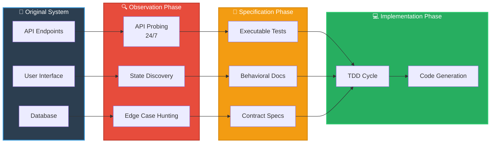

# Behavioral Specification

Behavioral specification documents **what a system does**, not **how it does it**. In clean room development, this is the ONLY source of truth since you cannot access the original source code. Every specification must be expressed as executable tests.

## Information Flow Diagram



## Definition

A behavioral specification is a complete, executable description of system behavior that:
- Describes observable inputs and outputs
- Captures state transitions and conditions
- Documents error conditions and recovery
- Defines performance and reliability constraints
- Specifies integration point behaviors

## The Specification = Test Principle

**Every specification is a test. Every test is a specification.**

This ensures:
- Specifications are precise and unambiguous
- Specifications are verifiable and executable
- Specifications evolve with understanding
- No drift between spec and implementation

## Layer 1: Protocol/Interface Discovery

### API Endpoint Mapping

Document every public interface:

```
API_ENDPOINT_MAP:
  endpoint: /api/v1/users
  methods: [GET, POST, PUT, DELETE]
  authentication: Bearer token required
  rate_limit: 1000 requests/hour
  
  GET /users:
    returns: 200 OK with user list
    query_params:
      - limit: int (default 100, max 1000)
      - offset: int (default 0)
      - filter: string (field:value format)
    response_schema: {"users": [...], "total": int}
    
  POST /users:
    requires: username, password, email
    returns: 201 Created with user object
    validation_errors:
      - invalid_username: "Username must be 3-50 chars"
      - duplicate_username: "Username already exists"
```

### Message Format Capture

Record exact input/output structures:

```python
# Example captured format
USER_OBJECT = {
    "id": "uuid",
    "username": "string (3-50 chars)",
    "email": "string (valid email format)",
    "created_at": "ISO 8601 timestamp",
    "status": "active|inactive|locked",
    "last_login": "ISO 8601 timestamp or null"
}
```

### Authentication Flow Discovery

Map all auth mechanisms:

```
AUTH_FLOW:
  type: OAuth2
  token_endpoint: /api/auth/token
  refresh_endpoint: /api/auth/refresh
  token_lifetime: 30 minutes
  refresh_lifetime: 7 days
  
  token_validation:
    - Header: Bearer {token}
    - 401 if invalid/expired
    - 403 if insufficient permissions
```

## Layer 2: State Machine Discovery

### User Journey Documentation

Trace complete workflows:

```
STATE_MACHINE: USER_ACCOUNT

States:
  - created
  - email_verified
  - active
  - locked
  - deleted

Transitions:
  created -> email_verified: [email confirmation click]
  created -> deleted: [user deletion request]
  email_verified -> active: [first successful login]
  active -> locked: [5 consecutive failed logins]
  active -> deleted: [user deletion request]
  locked -> active: [admin unlock OR 30 minute timeout]
  
Error States:
  authentication_failure: [track consecutive failures]
  rate_limit_exceeded: [track requests within time window]
```

### Edge Case Discovery

Systematic exploration of boundaries:

```python
# Edge case categories to test
BOUNDARY_TEST_CATEGORIES:
  - Empty/null inputs
  - Maximum length strings
  - Special characters
  - Unicode edge cases
  - Timezone variations
  - Concurrent operations
  - Race conditions
  - Network failures
  - Disk full conditions
  - Memory pressure
```

## Layer 3: Property-Based Testing

Use property-based testing to discover behaviors you didn't explicitly specify:

```python
from hypothesis import given, strategies as st

class TestLoginProperties:
    """Property-based tests discover edge cases"""
    
    @given(
        username=st.text(min_size=1, max_size=255),
        password=st.text(min_size=1, max_size=128),
        retry_count=st.integers(min_value=0, max_value=10)
    )
    def test_username_length_accepted(self, username, password):
        """System accepts usernames from 1 to 255 characters"""
        result = login(username, password)
        if len(username) <= 255:
            assert result.success == True
        else:
            assert result.error_code == "INVALID_USERNAME"
```

### Properties to Test

```python
SPECIFICATION_PROPERTIES:
  - Input validation: "All inputs within bounds produce valid results"
  - Output consistency: "Same input always produces same output"
  - State invariants: "System state always satisfies constraints"
  - Error recovery: "All errors are recoverable or properly logged"
  - Transaction atomicity: "Transactions either fully succeed or fully fail"
  - Security: "No unauthorized access possible at any state"
```

## Layer 4: Contract Testing

Define integration point contracts:

```python
class TestExternalApiContracts:
    """
    These contracts document expected behavior from external systems
    """
    
    def test_payment_gateway_success_callback(self):
        """
        System MUST handle payment success callback with:
        - Transaction ID
        - Amount
        - Currency
        - Timestamp
        - Signature for verification
        """
        callback = {
            'transaction_id': 'txn_12345',
            'amount': 99.99,
            'currency': 'USD',
            'timestamp': '2026-04-15T12:00:00Z',
            'signature': 'abc123...'
        }
        result = handle_payment_callback(callback)
        assert result.verified == True
        assert result.transaction_id == 'txn_12345'
```

## Layer 5: Non-Functional Requirements

Document performance and reliability:

```
PERFORMANCE_SPECIFICATION:
  user_login:
    p50_response_time: < 200ms
    p95_response_time: < 500ms
    p99_response_time: < 1000ms
    error_rate: < 0.1%
    
  api_throughput:
    requests_per_second: 10000
    concurrent_users: 50000
    
RELIABILITY_SPECIFICATION:
  uptime: 99.9%
  recovery_time_objective: < 4 hours
  recovery_point_objective: < 1 hour
  data_integrity: 100%
```

## The Specification Process

### Phase 1: Behavioral Analysis (No Code Access)

**Weeks 1-4: Discovery Sprint**

Activities:
- Daily API probing with automated scripts
- User journey documentation
- Error condition discovery
- Edge case hunting
- Integration point mapping

Deliverable: Behavioral specification v0.1 (raw observations)

### Phase 2: Test-First Specification Creation

**Weeks 5-8: Test Creation**

Activities:
- Write tests for each observed behavior
- Run tests against original system (as oracle)
- Refine tests until they capture exact behavior
- Document any ambiguities or inconsistencies

Deliverable: Behavioral specification v1.0 (executable tests)

### Phase 3: Validation and Gap Analysis

**Weeks 9-10: Gap Filling**

Activities:
- Review tests with domain experts
- Identify undocumented features
- Prioritize behaviors by business criticality
- Create backlog for discovery

Deliverable: Behavioral specification v1.1 (validated, gap analysis)

## Specification Quality Checklist

Before starting clean room implementation:

- [ ] All behaviors documented as executable tests
- [ ] Tests verified against original system (oracle)
- [ ] No implementation details in specifications
- [ ] Edge cases and error conditions covered
- [ ] Integration contracts defined and tested
- [ ] Performance baselines established
- [ ] Security behaviors documented
- [ ] Team trained on clean room process
- [ ] Legal review complete
- [ ] Clean room environment isolated

## Common Specification Patterns

### Pattern 1: Input-Output Specification

```python
def test_special_character_handling():
    """
    GIVEN: User provides special characters in username
    WHEN: System processes the input
    THEN: Special characters are properly escaped
    AND: No SQL injection possible
    AND: Output is displayed correctly
    """
```

### Pattern 2: State Transition Specification

```python
def test_account_lockout_behavior():
    """
    GIVEN: User account is unlocked
    WHEN: User provides wrong password 5 consecutive times
    THEN: Account becomes locked
    AND: System returns 423 Locked status
    AND: User receives account_lockout notification
    AND: Lockout persists for 30 minutes OR until admin unlock
    """
```

### Pattern 3: Error Recovery Specification

```python
def test_network_failure_recovery():
    """
    GIVEN: API call in progress
    WHEN: Network failure occurs
    THEN: Operation is retried up to 3 times
    AND: Success rate on retry is > 90%
    AND: User is not notified of transient failures
    AND: Failed operations are logged for retry
    """
```

## Tools for Behavioral Specification

### API Testing
- **Postman**: Manual API exploration and documentation
- **Pytest + Requests**: Automated API testing
- **HTTPie**: Command-line API testing

### Property-Based Testing
- **Hypothesis** (Python): Discover edge cases through property testing
- **QuickCheck** (Haskell): Original property-based testing library
- **FastCheck** (JavaScript): Property testing for JS

### Contract Testing
- **Pact**: Consumer-driven contract testing
- **Spring Cloud Contract**: Contract testing for Java
- **Grpc-verify**: gRPC contract verification

### Performance Benchmarking
- **Locust**: Load testing and performance benchmarking
- **k6**: Performance testing for developers
- **Apache JMeter**: Comprehensive load testing

## Related Concepts
- [[clean-room-engineering]]
- [[test-driven-development]]
- [[property-based-testing]]
- [[contract-testing]]
- [[parallel-testing-strategy]]
- [[legal-framework]]
- [[ai-agent-methodologies]]

## See Also
- [[practical-implementation-guide]] - Test templates
- [[delegate-task-workflows]] - AI workflows for discovery
## Pitfalls

- **Testing implementation details**: Test behavior, not internal structure
- **Missing edge cases**: Systematically explore boundaries
- **Over-specification**: Don't specify exact implementation choices
- **Under-documentation**: Every behavior must be captured
- **Inconsistent format**: Use standard templates for all specifications
