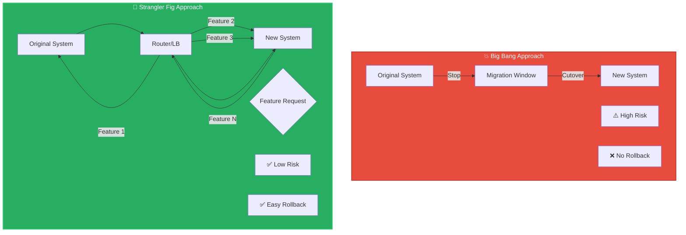
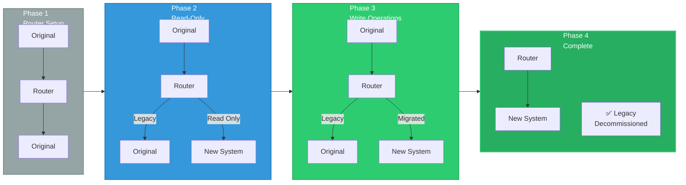

# Migration Strategy

Migration is the final phase of clean room implementation where the new system replaces the old one. For enterprise applications with millions of lines of code, this is NOT a "big bang" replacement but a carefully orchestrated incremental migration.

## The Strangler Fig Pattern

Named after the vine that slowly strangles its host tree, this pattern involves:
- Gradually replacing functionality piece by piece
- Keeping the old system running until everything migrates
- Zero-downtime cutover for each migrated component

### Why Strangler Fig?

```
BIG BANG MIGRATION (AVOID):
  ❌ All-or-nothing approach
  ❌ Massive cutover event
  ❌ High risk of failure
  ❌ No rollback path
  ❌ Business disruption
  
STRANGLER FIG (RECOMMENDED):
  ✓ Incremental replacements
  ✓ Zero-downtime per feature
  ✓ Gradual risk exposure
  ✓ Easy rollback per component
  ✓ Minimal business disruption
```

## Migration Patterns Comparison



## Strangler Fig Migration Phases



## Migration Phases

### Phase 1: Parallel System Setup (Months 1-2)

Before any migration, establish both systems:

```
PARALLEL_SETUP:
  - New system deployed and operational
  - Old system still running production
  - Routing layer configured for both
  - Data synchronization established
  - Feature flags enabled for control
```

### Phase 2: Read-Only Migration (Months 2-4)

Start with non-critical, read-only features:

```
READ_ONLY_FEATURES:
  - User profile viewing
  - Product catalog browsing
  - Public documentation
  - Search functionality
  - Reporting (historical data)
```

**Benefit**: Tests the new system without affecting users

### Phase 3: Write-Operation Migration (Months 4-12)

Gradually migrate state-changing operations:

```
WRITABLE_FEATURES:
  - User account updates
  - Order creation
  - Payment processing
  - Email notifications
  - Data exports
```

### Phase 4: Core Business Logic Migration (Months 12-24)

Migrate the most critical functionality:

```
CORE_LOGIC:
  - Main transaction processing
  - Business rules engine
  - Complex workflows
  - Integration with external systems
```

### Phase 5: Legacy System Decommission (Month 24+)

Once all functionality is migrated:

```
DECOMMISSION:
  - Final data sync verification
  - Rollback procedures tested
  - Old system shutdown schedule
  - Team reassignment
  - Cost savings realization
```

## Strangler Fig Implementation

### Routing Layer Setup

```python
# Feature-based routing example

class MigrationRouter:
    def route_request(self, feature, request):
        if self.should_use_new_system(feature):
            return self.new_system_endpoint(feature, request)
        else:
            return self.old_system_endpoint(feature, request)
    
    def should_use_new_system(self, feature):
        """
        Check feature flag for migration status
        Returns True if feature has been migrated
        """
        return self.feature_flags.get(f'migrate_{feature}', False)
```

### Feature Flag Management

```yaml
# feature-flags.yaml
features:
  user_profile:
    migrated: true
    percentage: 100
    rollout_completed: "2026-04-01"
  
  order_processing:
    migrated: true
    percentage: 100
    rollout_completed: "2026-04-10"
  
  payment_gateway:
    migrated: false
    percentage: 0
    planned_start: "2026-06-01"
  
  inventory_management:
    migrated: true
    percentage: 75
    rollout_in_progress: true
```

## Data Migration Strategy

### Initial Data Sync

Before migration, sync all data:

```python
class DataSync:
    def __init__(self, old_db, new_db):
        self.old_db = old_db
        self.new_db = new_db
    
    def full_sync(self):
        """Initial full data synchronization"""
        for entity in self.old_db.list_entities():
            self.sync_entity(entity)
    
    def sync_entity(self, entity_name):
        """Sync a single entity type"""
        old_records = self.old_db.query(entity_name)
        new_records = self.new_db.batch_insert(entity_name, old_records)
        return new_records
    
    def incremental_sync(self):
        """Ongoing sync for changes during migration"""
        # Sync based on last_modified timestamps
        # Handles updates and deletes
        pass
```

### Dual-Write Pattern

During migration, write to both systems:

```python
class DualWriteService:
    def create_order(self, order_data):
        # Write to old system
        old_result = self.old_system.create_order(order_data)
        
        # Write to new system
        new_result = self.new_system.create_order(order_data)
        
        # Log for reconciliation
        self.log_transaction(old_result.id, new_result.id)
        
        return new_result  # Return new system result
    
    def reconcile(self):
        """Ensure both systems have identical data"""
        old_data = self.old_system.export_all()
        new_data = self.new_system.export_all()
        
        discrepancies = self.compare_datasets(old_data, new_data)
        
        for discrepancy in discrepancies:
            self.fix_discrepancy(discrepancy)
```

### Cutover Strategy

For each feature:

```
FEATURE_CUTOVER_CHECKLIST:
  [ ] Feature fully migrated and tested
  [ ] Dual-write running for 30 days
  [ ] No data discrepancies found
  [ ] Performance verified on new system
  [ ] Rollback procedure documented and tested
  [ ] Stakeholders notified
  [ ] Cutover scheduled
  [ ] Monitoring tools configured
  [ ] On-call team ready
  
  CUTOVER_EVENT:
    1. Disable writes to old system
    2. Final incremental sync
    3. Verify data consistency
    4. Switch routing to new system
    5. Monitor for errors
    6. Validate user experience
    7. Decommission old system path
```

## Migration Patterns

### Pattern 1: Read-Write Separation

```
READ-ONLY FEATURES FIRST:
  - User profiles
  - Product catalogs
  - Search results
  - Public documentation
  
BENEFIT: Tests new system without data risk
```

### Pattern 2: User Segment Rollout

```
GRADUAL_USER_ROLLOUT:
  1. Internal team (1%)
  2. Beta users (5%)
  3. Regional rollout (20%)
  4. National rollout (50%)
  5. Full rollout (100%)
  
BENEFIT: Limits blast radius of issues
```

### Pattern 3: Feature Flag Control

```
FEATURE_FLAGS:
  - Enable/disable per feature
  - Configure percentage rollout
  - Immediate rollback capability
  - A/B testing support
  
BENEFIT: Instant control over migration
```

## Migration Monitoring

### Key Metrics

```
MIGRATION_METRICS:
  - Feature migration percentage
  - Dual-write discrepancy count
  - New system error rate
  - Old system error rate
  - Response time comparison
  - User satisfaction scores
  - Rollback frequency
```

### Alerting

```
ALERT_THRESHOLDS:
  - New system error rate > 1%: Immediate alert
  - Data discrepancy > 0.1%: Investigation required
  - Response time degradation > 20%: Rollback consideration
  - User complaint spike: Feature flag investigation
```

## Rollback Strategy

### When to Rollback

```
ROLLBACK_TRIGGER:
  [ ] Critical bugs preventing feature usage
  [ ] Data corruption or loss
  [ ] Performance degradation > 50%
  [ ] Security vulnerabilities discovered
  [ ] Business impact exceeding tolerance
  
ROLLBACK_PROCEDURE:
  1. Disable new system routing
  2. Enable old system routing
  3. Sync any new data from dual-write
  4. Verify old system operational
  5. Document incident
  6. Analyze root cause
  7. Plan re-migration
```

### Rolling Back a Feature

```python
def rollback_feature(feature_name):
    # Disable new system routing
    feature_flags.set(f'migrate_{feature_name}', False)
    
    # Final sync
    sync_final_data(feature_name)
    
    # Verify old system has all data
    verify_data_consistency(feature_name)
    
    # Log rollback
    log_rollback_event(feature_name)
    
    # Notify stakeholders
    notify_team(f'{feature_name} rolled back')
```

## Common Migration Challenges

### Challenge 1: Data Schema Differences

**Problem**: New system has different data model

**Solution**:
- Create compatibility layer
- Transform data during sync
- Gradually migrate schema changes

### Challenge 2: External System Dependencies

**Problem**: Old system integrated with external APIs

**Solution**:
- Create adapters for new system
- Test integrations thoroughly
- Coordinate with external systems

### Challenge 3: Performance Differences

**Problem**: New system slower than expected

**Solution**:
- Profile and optimize
- Add caching layers
- Scale infrastructure
- Consider incremental performance improvements

### Challenge 4: User Adoption Resistance

**Problem**: Users prefer old system

**Solution**:
- Training and documentation
- Feature parity first
- Gather feedback and iterate
- Gradual transition with support

## Migration Timeline Realities

### Small System (50K-500K lines)

```
TIMELINE:
  - Development: 12-18 months
  - Migration: 3-6 months
  - Total: 15-24 months
  - Team: 5-10 engineers
```

### Medium System (500K-5M lines)

```
TIMELINE:
  - Development: 18-36 months
  - Migration: 6-12 months
  - Total: 24-48 months
  - Team: 10-25 engineers
```

### Large System (5M+ lines)

```
TIMELINE:
  - Development: 36-60 months
  - Migration: 12-24 months
  - Total: 48-84 months
  - Team: 25-50+ engineers
```

## Related Concepts
- [[clean-room-engineering]]
- [[parallel-testing-strategy]]
- [[quality-assurance]]
- [[legal-framework]]

## See Also
- [[practical-implementation-guide]] - Migration code examples
- [[clean-room-fundamentals-diagram]] - Migration visualization
## Pitfalls

- **Big bang migration**: Never replace everything at once
- **Insufficient testing**: Dual-write period is essential
- **No rollback plan**: Always test rollback procedures
- **Performance surprises**: Profile early and often
- **User resistance**: Involve users in the transition
