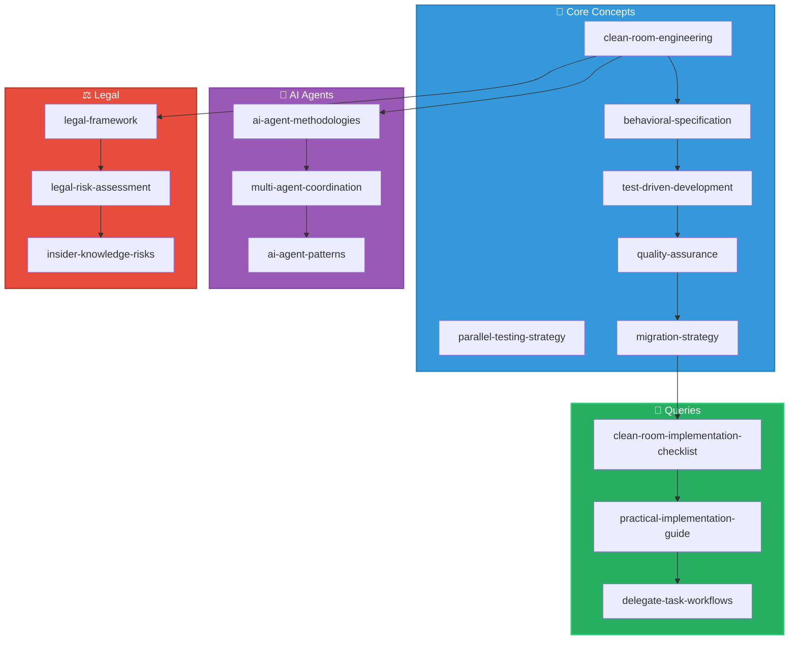

# Clean Room Implementation with AI Agents Wiki Index

<div align="center">


**Author:** [@T-450](https://github.com/T-450)  
**Email:** edward.teixeira.dias@gmail.com

```
  📚 WIKI KNOWLEDGE GRAPH 📚
```

**Total Pages**: 16+ | **Wikilinks**: 100+ | **Last Updated**: 2026-04-15

</div>

## Knowledge Graph Overview



## Content Catalog

### Core Concepts

- [[clean-room-engineering]] - Clean room software development methodology for independent implementation without source code access
- [[behavioral-specification]] - Test-first approach for documenting observable system behavior as executable specifications
- [[test-driven-development]] - TDD methodology for clean room implementation with red-green-refactor cycle
- [[parallel-testing-strategy]] - Continuous verification by running tests against both original and new systems
- [[quality-assurance]] - Comprehensive QA process with original system as oracle for verification
- [[migration-strategy]] - Strangler fig pattern for incremental replacement of legacy systems

### AI Agent Concepts

- [[ai-agent-methodologies]] - Core methodologies for using AI agents in clean room implementation
- [[multi-agent-coordination]] - Coordination patterns and protocols for managing multiple AI agents
- [[ai-agent-patterns]] - Catalog of proven patterns for AI agent clean room implementation

## Legal
## Legal
- [[legal-framework]] - Legal considerations, team separation, and audit requirements for clean room compliance
- [[legal-risk-assessment]] - Comparison of IP risks and mitigation strategies for clean room implementation
- [[insider-knowledge-risks]] - Detailed analysis of legal risks from former employees of original company

## Comparisons

- [[migration-approach-comparison]] - Big bang vs. strangler fig vs. parallel migration approaches

## Queries

- [[clean-room-implementation-checklist]] - Complete checklist for all phases of clean room implementation
- [[practical-implementation-guide]] - Code templates and practical examples for implementation
- [[delegate-task-workflows]] - Practical workflows for using delegate_task tool in clean room context


## Navigation
- [[SCHEMA]] - Wiki conventions and rules
- [[log]] - Wiki action history
- [[clean-room-fundamentals-diagram]] - Visual overview

## Quick Links
- [[insider-knowledge-risks]] - Legal risk analysis
- [[clean-room-implementation-checklist]] - Implementation checklist
